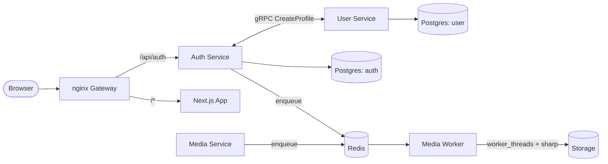

<h1 align="center">Vishisht Dwivedi</h1>

CS undergrad @ **IIIT Bhopal** who builds the layer underneath the app — hand-rolled TCP reactors, multithreaded filesystem daemons, gRPC/queue-driven microservice meshes. **Seeking Systems / Backend / Infra internships.**

&nbsp;&nbsp;&nbsp;

### ⚙️ Systems Engineering

| Project | Under the hood | Stack |
|---|---|---|
| **[Velora](https://github.com/Vishisht-Dwivedi/Velora)** | Hand-written TCP engine — single-threaded **epoll reactor**, ring-buffered per-connection I/O, custom 8-byte binary frame (magic·version·type·flags·len) driving CONNECT/PING/STREAM_OPEN/PUBLISH opcodes, **256 multiplexed streams per socket**, connection table sized for **65,536 concurrent sockets**. Ships its own load-test rig — churn, concurrent-churn & Slowloris scripts to prove it survives. | `C` `epoll` `Linux` |
| **[chronofs](https://github.com/Vishisht-Dwivedi/chronofs)** | Filesystem-watch **daemon** — recursive `inotify` trees, **thread-per-watcher** POSIX model bridged over **Unix Domain Socket IPC** to a CLI client, dynamic watcher (un)registration with auto-expansion into new subdirs, snapshot-commit versioning (rollback in progress). | `C` `pthreads` `inotify` |

Root of it all: **[low-level-server](https://github.com/Vishisht-Dwivedi/low-level-server)** — raw TCP/UDP/WebRTC chatrooms + bare C sockets, the sandbox Velora grew out of.

### 🕸️ Sermocino — distributed messaging platform
**[github.com/Vishisht-Dwivedi/Sermocino](https://github.com/Vishisht-Dwivedi/Sermocino)** · pnpm monorepo, independently deployable services, polyglot-style comms:

- **Fastify** services (`auth` · `user` · `media`) — independently deployable, each with auto-generated Swagger/OpenAPI docs
- **gRPC + Protobuf** for internal RPC (auth service calls user service's `CreateProfile`), typed via a shared workspace package
- **BullMQ over Redis** decouples slow work from the request path; `media-worker` further offloads CPU-bound media-processing to Node **worker_threads** running `sharp`
- **nginx** gateway doing path-based routing across services + the Next.js frontend
- **Postgres via Prisma**, schema-per-service (`auth`, `user`) — real data-ownership boundaries, not a shared blob
- Auth hardened: bcrypt hashes, JWT + **rotating refresh tokens hashed at rest and revocable**, per-session device fingerprinting (IP/OS/browser/UA), OTP email verification
- Dockerfile per service, root `compose.yaml` with healthchecks; shared Zod schemas + gRPC types give compile-time safety across service boundaries

### 🌐 Product Engineering

| Project | Details | Stack |
|---|---|---|
| **[Academia Tempore](https://github.com/Vishisht-Dwivedi/Academia_Tempore)** | Full-stack scheduling platform for **IIIT Bhopal** — Apollo **GraphQL** API over MongoDB/Mongoose, JWT auth with **RBAC**, a collision-detection engine for clash-free timetables, Zustand state. | `Next.js 15` `Express 5` `GraphQL` `MongoDB` |
| **Freelance** | [Laxmi Finsec](https://www.laxmifinsec.com/) · [Prof. Rahul Chaurasia](https://www.rahulchaurasia.com/) · [Manthan Rehab](https://www.manthanrehab.org/) — production sites shipped end-to-end for real clients. | `React` `Next.js` `Tailwind` |

Also shipped: <a href="https://vishisht-dwivedi.github.io/waves-simulation/">waves-simulation</a> — sine-wave field renderer · <a href="https://github.com/Vishisht-Dwivedi/diurnal-chronique">diurnal-chronique</a> — retro news portal with live D3 crypto charts · <a href="https://github.com/Vishisht-Dwivedi/IIITB-IEEE-SBC">IEEE CS SBC site</a> — animated SPA w/ Nodemailer backend · <a href="https://github.com/Vishisht-Dwivedi/Blob-Simulations">Blob-Simulations</a> / <a href="https://github.com/Vishisht-Dwivedi/Physics-simulation-using-balls">Physics-Balls</a> — canvas physics, zero libraries

### 🏆 Open Source & Campus
    

<i>Coffee, rain, music and a black/blue wall of code</i>

